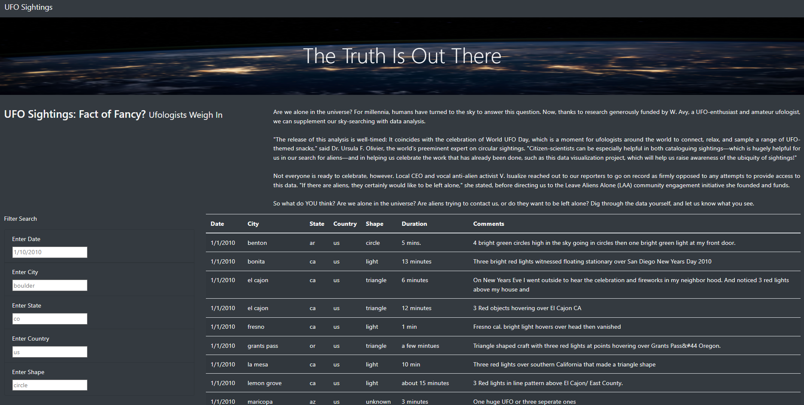
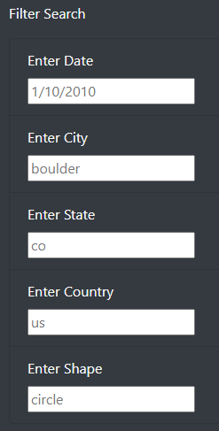
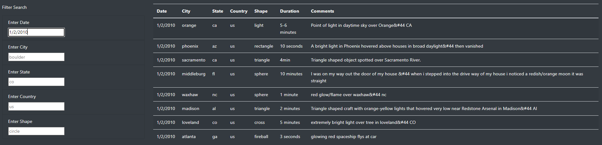
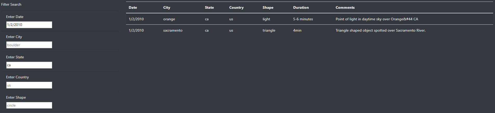
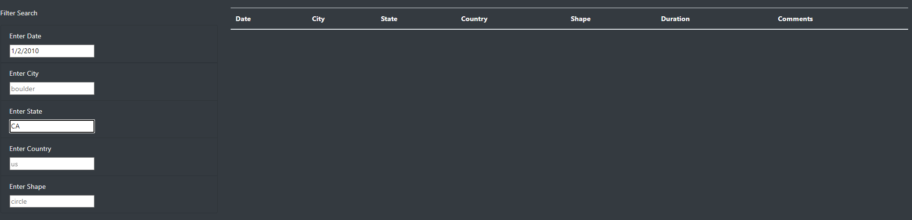

# RBC-Module-11-UFO-Sightings-with-JavaScript

## Overview
During the course of this project we had to assist Dana, a data journalist who had been given the opportunity to write her first own personal piece. Here she picked up her hometown McMinnville, Oregon and its famous UFO Sightings as her piece. The work on this project we took an enormous JavaScript database file with UFO sighting information across the country.

## Purpose
The purpose of this project was to exemplify the use of `JavaScript` and its enormous integration capabilities with HTML and use-case scenarios. Here we worked with a large JavaScript database file which stored information about UFO Sightings across the USA. Here we built a live website which hosted the `data.js` file and interactively allowed us to filter data from it.

## Files Used
* [index.html](index.html) - Our HTML file where the code for our website resides. It also links our `app.js` and `data.js`. The styling is done by our css file  which is also linked via the HTML file.
* [style.css](static/css/style.css) - Our CSS file for styling the website after adding `bootstrap.min.css`.
* [app.js](static/js/app.js) - File where our functions for filtering out data from the `data.js` file.
* [data.js](static/js/data.js) - Our database in JavaScript `Array` form.

## Summary and Drawback
The picture below shows how the website looks in action. Here is a working link to the website.

We were able to style the website using the following code block found in our `style.css`:
```
body {
    color: #f7f7f7;
}

.jumbotron {
    background-image: url("../images/nasa.jpg");
    background-size: 100% 100%;
    text-align: center;
}

.col-md-8 {
    text-align: justify;
}
```
Here is the filter in action:






The code block used for making the filter interactive in `JavaScript`.
```
// 1. Create a variable to keep track of all the filters as an object.
let filters = {};

// 3. Use this function to update the filters. 
function updateFilters() {

    // 4a. Save the element that was changed as a variable.
    let changedElement = d3.select(this);
    // 4b. Save the value that was changed as a variable.
    let elementValue = changedElement.property("value");
    console.log(elementValue); 
    // 4c. Save the id of the filter that was changed as a variable.
    let filterId = changedElement.attr("id");
    console.log(filterId); 

    // 5. If a filter value was entered then add that filterId and value
    // to the filters list. Otherwise, clear that filter from the filters object.
    if (elementValue){
        filters[filterId] = elementValue;
    }
    else {
        delete filters[filterId];
    }
  
    // 6. Call function to apply all filters and rebuild the table
    filterTable();
  
  }
  
  // 7. Use this function to filter the table when data is entered.
  function filterTable() {
  
    // 8. Set the filtered data to the tableData.
    let updateFilters = tableData;
  
    // 9. Loop through all of the filters and keep any data that
    // matches the filter values
    Object.keys(filters).forEach((key) => {
        let userInput = d3.select("#"+key).property("value");
        if (userInput){
            updateFilters = updateFilters.filter(row => row[key] === userInput)
        };
    });
  
    // 10. Finally, rebuild the table using the filtered data
    buildTable(updateFilters);
  }
  
  // 2. Attach an event to listen for changes to each filter
  d3.selectAll("input").on("change",updateFilters);
  
  // Build the table when the page loads
  buildTable(tableData);
```

## Drawbacks
One of the major drawbacks of the filter is that it is case sensitive and will not work if the case of letters doesn't match the data available in `data.js`.


## Recommendations
* The website is built on a database stored in a JavaScript file which is not being updated and is very old. A live source would be more reliable and preferred by most of the user base.
* The filter could be modified to work with case sensitivity where it automatically causes any uppercase letter to be converted into lowercase while the filter is being applied.
* Duration and Comments section of the filters are not being used properly. These can be further explored for further visualization of the data.
